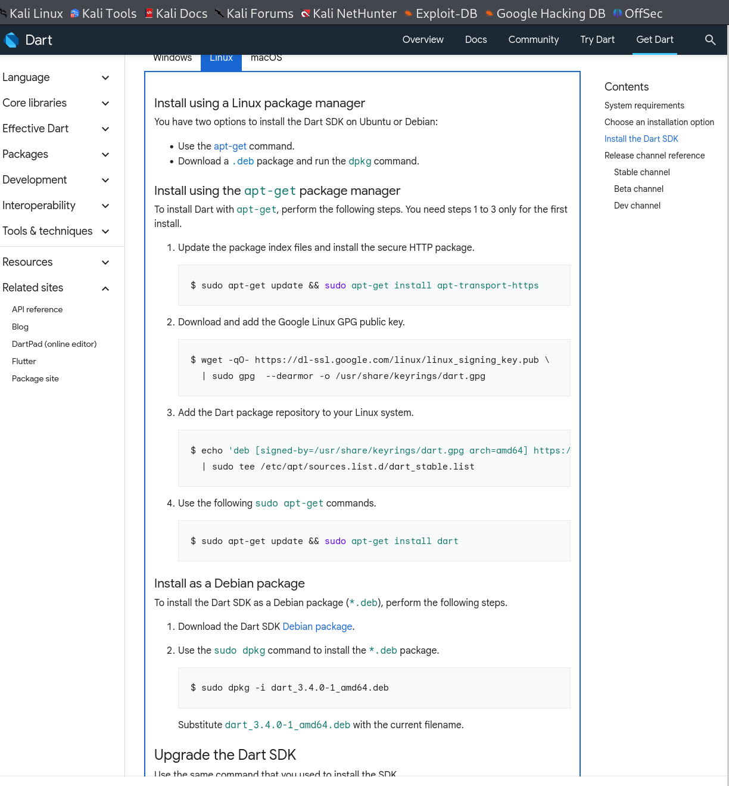
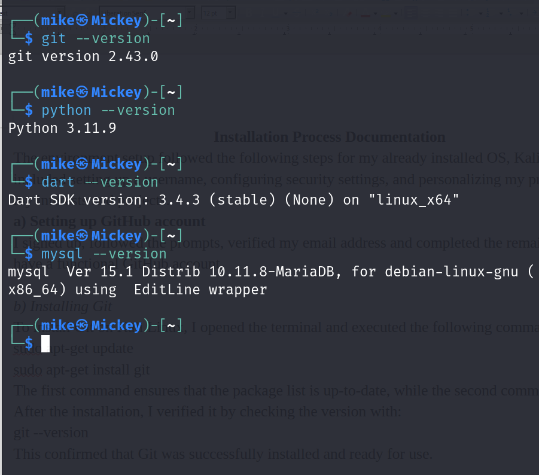

# Dev_Setup
Setup Development Environment

#Assignment: Setting Up Your Developer Environment

#Objective:
This assignment aims to familiarize you with the tools and configurations necessary to set up an efficient developer environment for software engineering projects. Completing this assignment will give you the skills required to set up a robust and productive workspace conducive to coding, debugging, version control, and collaboration.

#Tasks:

1. Select Your Operating System (OS):
   Choose an operating system that best suits your preferences and project requirements. Download and Install Windows 11. https://www.microsoft.com/software-download/windows11

2. Install a Text Editor or Integrated Development Environment (IDE):
   Select and install a text editor or IDE suitable for your programming languages and workflow. Download and Install Visual Studio Code. https://code.visualstudio.com/Download
3. Set Up Version Control System:
   Install Git and configure it on your local machine. Create a GitHub account for hosting your repositories. Initialize a Git repository for your project and make your first commit. https://github.com

4. Install Necessary Programming Languages and Runtimes:
  Instal Python from http://wwww.python.org programming language required for your project and install their respective compilers, interpreters, or runtimes. Ensure you have the necessary tools to build and execute your code.

5. Install Package Managers:
   If applicable, install package managers like pip (Python).

6. Configure a Database (MySQL):
   Download and install MySQL database. https://dev.mysql.com/downloads/windows/installer/5.7.html

7. Set Up Development Environments and Virtualization (Optional):
   Consider using virtualization tools like Docker or virtual machines to isolate project dependencies and ensure consistent environments across different machines.

8. Explore Extensions and Plugins:
   Explore available extensions, plugins, and add-ons for your chosen text editor or IDE to enhance functionality, such as syntax highlighting, linting, code formatting, and version control integration.

9. Document Your Setup:
    Create a comprehensive document outlining the steps you've taken to set up your developer environment. Include any configurations, customizations, or troubleshooting steps encountered during the process. 

#Deliverables:
- Document detailing the setup process with step-by-step instructions and screenshots where necessary.
- A GitHub repository containing a sample project initialized with Git and any necessary configuration files (e.g., .gitignore).
- A reflection on the challenges faced during setup and strategies employed to overcome them.
[text](<../../../Documents/Installation Process Documentation .pdf>)
#Submission:
Submit your document and GitHub repository link through the designated platform or email to the instructor by the specified deadline.

#Evaluation Criteria:**
- Completeness and accuracy of setup documentation.
- Effectiveness of version control implementation.
- Appropriateness of tools selected for the project requirements.
- Clarity of reflection on challenges and solutions encountered.
- Adherence to submission guidelines and deadlines.

Note: Feel free to reach out for clarification or assistance with any aspect of the assignment.

Installation Process Documentation 
The environment setup followed the following steps for my already installed OS, Kali Linux. This included setting up a username, configuring security settings, and personalizing my profile to reflect my interests and projects.
a) Setting up GitHub account
I signed up, followed the prompts, verified my email address and completed the remaining prompts to have a functional GitHub account. 

b) Installing Git 
To install Git on Kali Linux, I opened the terminal and executed the following command:
sudo apt-get update
sudo apt-get install git
The first command ensures that the package list is up-to-date, while the second command installs Git. After the installation, I verified it by checking the version with:
git --version
This confirmed that Git was successfully installed and ready for use.

c) Linking Git and GitHub
To link Git and GitHub, I started by generating an SSH key. This key is used to securely connect my local Git repository with GitHub. I generated the SSH key using the following command:
ssh-keygen -t rsa -b 4096 -C "my email"

I followed the prompts to save the key to the default location and added a passphrase for additional security. After generating the SSH key, I added it to the SSH agent with:
eval "$(ssh-agent -s)"
ssh-add ~/.ssh/id_rsa

Next, I copied the SSH key to the clipboard:
cat ~/.ssh/id_rsa.pub

I then logged into my GitHub account, navigated to Settings > SSH and GPG keys, and added a new SSH key by pasting the copied key into the provided field.

To confirm the setup, I tested the connection between Git and GitHub:
ssh -T git@github.com
Upon successful authentication, GitHub provided a confirmation message.

d) Configuring Git
I configured Git with my user information to associate my commits with my GitHub account. I used the following commands:
git config --global user.name "My name"
git config --global user.email "my email"

e) Installing python
To check if Python is installed, I ran:
python3 --version
However, I did not have the right version, so I ran the following commands to update: 
sudo apt-get update
sudo apt-get install python3
Additionally, I installed `pip`, the Python package installer, which is essential for managing Python libraries:
sudo apt-get install python3-pip
pip3 --version

f) Installing Dart SDK

I followed the Instructions from : https://dart.dev/get-dart website as indicated in the screen shot attached above.
 

g) Installing Visual Studio
To install VS Code on Kali Linux, I downloaded the .deb package from the official Visual Studio Code website and installed it using:
sudo dpkg -i code_*.deb
sudo apt-get install -f
I launched VS Code from the terminal or applications menu to ensure it was installed correctly. To make VS Code more powerful and tailored to my development needs, I installed several extensions. Here are the key extensions I added: pylance, python extension, prettier. 
h) Installing Django Environment 

I selected the desired drive and created a directory using mkdir. I then moved to the directory. To set up the Django environment, I first ensured that Python and `pip` were installed. With Python and `pip` in place, I proceeded to create a virtual environment to manage project-specific dependencies:
pip3 install virtualenv
virtualenv venv
source venv/bin/activate
With the virtual environment activated, I installed Django using `pip`:
python -m pip install django

To verify the installation, I checked the Django version:
django-admin –version 

This confirmed that Django was successfully installed. 

i) Installing MySQL
MySQL is a popular relational database management system used in many web applications. To install MySQL on Kali Linux, I used the following command:

sudo apt-get update
sudo apt-get install mysql-server

During the installation process, I was prompted to set a root password for MySQL. I secured the installation by running:

sudo mysql_secure_installation

This utility helped me set up the root password, remove anonymous users, disallow root login remotely, remove test databases, and reload the privilege tables.

